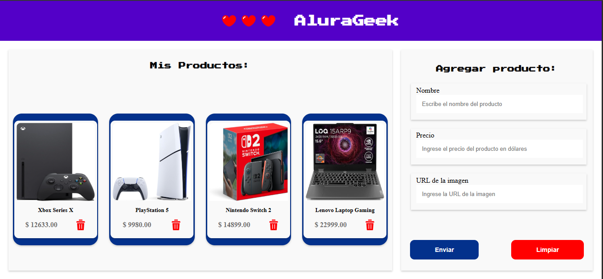

# Challenge AluraGeek ✨

## 🎯 Objetivo del Desafío

Este proyecto tiene como finalidad desarrollar una aplicación web para la gestión de productos, permitiendo a los usuarios realizar las siguientes operaciones:

- **Listar** productos existentes 📋
- **Registrar** nuevos productos ➕
- **Eliminar** productos de la lista 🗑️

---

## 🚀 Configuración y Ejecución Local

Para poner en marcha este proyecto en tu entorno local, sigue los pasos a continuación.

### ⬇️ Clonar el Repositorio

Primero, clona este repositorio en tu máquina local y navega hasta el directorio del proyecto:

```bash
git clone https://github.com/josecervera20/challenge-AluraGeek.git
cd challenge-AluraGeek
```

## 🚀 Servidor Local (JSON Server)

Este proyecto simula una API RESTful utilizando [JSON Server](https://github.com/typicode/json-server), lo cual requiere una configuración local para su correcto funcionamiento.

### Requisitos Previos

Asegúrate de tener instalado:

- [Node.js](https://nodejs.org/es/) y [npm](https://www.npmjs.com/) (gestor de paquetes de Node.js).

### Pasos para Iniciar el Servidor

Sigue estos sencillos pasos en tu terminal:

1.  **Inicializar el proyecto Node.js:**

    ```bash
    npm init -y
    ```

    _(`npm init -y` omite las preguntas y crea un `package.json` por defecto)._

2.  **Crear el archivo `db.json`:**

    - Crea una carpeta llamada `database` en la raíz de tu proyecto.
    - Dentro de `database`, crea un archivo `db.json` con la siguiente estructura inicial:
      ```json
      {
        "products": [
          {
            "id": "1",
            "name": "Xbox Series X",
            "price": 12633,
            "image": "https://m.media-amazon.com/images/I/51ojzJk77qL._AC_SX679_.jpg"
          }
        ]
      }
      ```

3.  **Instalar JSON Server:**

    ```bash
    npm install json-server
    ```

    _Este comando creará la carpeta `node_modules` y añadirá `"json-server": "^1.0.0-beta.1"` a las dependencias en tu `package.json`._

4.  **Iniciar el servidor JSON:**
    Puedes ejecutar el servidor directamente con:

    ```bash
    npx json-server --watch database/db.json --port 3000
    ```

    **¡Recomendado!** Para mayor comodidad, puedes añadir un script a tu `package.json` en el campo `"scripts"`:

    ```json
    "scripts": {
        "start": "npx json-server --watch database/db.json --port 3000"
    }
    ```

    Con este script, simplemente inicia el servidor ejecutando:

    ```bash
    npm start
    ```

    Esto iniciará el servidor local, permitiendo acceder a la API REST simulada.
    La base de datos estará disponible en: `http://localhost:3000`
    Los recursos de productos se accederán a través de: `http://localhost:3000/products`

### Ejemplos de Uso de la API REST

- **`GET http://localhost:3000/products`**: Recupera una lista de todos los productos.
- **`POST http://localhost:3000/products`**: Agrega un nuevo producto a la base de datos.
- **`DELETE http://localhost:3000/products/:id`**: Elimina un producto específico por su `ID`. (Ejemplo: `http://localhost:3000/products/1` eliminaría el producto con `ID` 1).

---

## 📂 Estructura del Proyecto

```
.
├── assets/
│   ├── icons/           # 🖼️ Iconos utilizados en la interfaz.
│   └── images/          # 🖼️ Imágenes del proyecto (logos, demos, etc.).
├── database/
│   └── db.json          # 🗄️ Base de datos simulada con JSON Server.
├── js/
│   ├── controllers/
│   │   └── main.js      # 🕹️ Lógica principal para la interacción con la UI y renderización de productos.
│   ├── err/
│   │   └── customError.js # ❌ Mensajes de error personalizados para validaciones.
│   └── services/
│   │   └── productServices.js # 🌐 Funciones para interactuar con la API REST (CRUD de productos).
│   └── validators/
│       └── formValidator.js # ✅ Lógica de validación para los formularios de entrada de datos.
├── node_modules/        # 📦 Dependencias del proyecto instaladas con npm.
├── styles/
│   ├── style.css        # 🎨 Estilos principales para la aplicación (productos y formulario).
│   └── root.css         # 🎨 Definición de variables CSS globales (colores, fuentes, etc.).
├── .gitignore           # 🚫 Archivo que especifica los archivos y directorios que Git debe ignorar.
├── index.html           # 🌐 Página principal HTML de la aplicación.
├── package-lock.json    # 🔒 Registro detallado de las dependencias y sus versiones exactas.
├── package.json         # 📋 Manifiesto del proyecto, gestiona dependencias y scripts.
└── README.md            # 📄 Documentación del proyecto (este archivo).
```

### Explicación de Archivos Clave:

- **`db.json` (`database/db.json`)**: Contiene los datos de los productos en formato JSON. Es la "base de datos" simulada que se manipula mediante solicitudes HTTP.

- **`main.js` (`js/controllers/main.js`)**: Encargado de la lógica de presentación y manejo de eventos del usuario. Renderiza la lista de productos y coordina las interacciones con la interfaz.

- **`customError.js` (`js/err/customError.js`)**: Define y exporta mensajes de error específicos para una mejor experiencia de usuario en la validación de formularios.

- **`productServices.js` (`js/services/productServices.js`)**: Abstrae las operaciones de la API REST. Contiene funciones para realizar operaciones **GET**, **POST** y **DELETE** sobre los recursos de productos.

- **`formValidator.js` (`js/validators/formValidator.js`)**: Implementa la lógica para validar los datos introducidos por el usuario en el formulario de registro de productos, asegurando la integridad de la información.

- **`index.html`**: Es el punto de entrada de la aplicación. Define la estructura HTML de la página y enlaza los archivos CSS y JavaScript necesarios para el funcionamiento y estilo de la aplicación.

---

## 📸 Demo



---

## 🛠️ Tecnologías Principales

- **HTML5** 🌐: Estructura semántica de la página.
- **CSS3** 🎨: Estilos y diseño responsivo para una experiencia de usuario consistente en desktop, tablet y móvil.
- **JavaScript** 💻: Lógica de programación, interactividad y manipulación del DOM.

### Tecnologías Secundarias y Herramientas

- **Node.js y npm** 📦: Entorno de ejecución y gestor de paquetes.
- **JSON Server** 📡: Herramienta para simular una API REST localmente.
- **VS Code** 📝: Entorno de desarrollo integrado (IDE).
- **Git** 🌿: Sistema de control de versiones.
- **GitHub** 🔗: Plataforma para el alojamiento y colaboración de proyectos de código.

---

## 🤝 Contribuciones

¡Las contribuciones son siempre bienvenidas! Si tienes ideas para mejorar este proyecto, o encuentras algún problema, no dudes en:

1.  Hacer un `fork` del repositorio.
2.  Crear una nueva rama (`git checkout -b feature/tu-mejora`).
3.  Enviar un `pull request` con una descripción detallada de tus cambios.

---

## 📄 Licencia

Este proyecto es de código abierto y se publica bajo la [Licencia MIT](LICENSE). Siéntete libre de usar, modificar y distribuir este código para tus propios proyectos.
